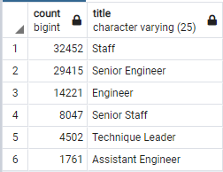

# Pewlett-Hackard-Retiring-employee-Analysis

## Overview and purpose
the main purpose of this analysis was two fold. Firstly, it was to see how many people are going to be leaving the company as well as what percentage of them are eligible for their retirment membership program, and secondly to transfer all the employment information from VBA into a more modern format.

## Results

The results are as follow
- a large portion of the employment base is going to be leaving soon
- there are not enough people at the company to replace those who are leaving 
- there are many employees that are eligable for the program
- there are alot of higher positions leaving

## Summary

with the aging of the work force we need to prepare for the inevitability of a large portion of the work force leaving and few people ready to take their place. with over 85,000 people about to age out, and very few people who are ready to take their positions, we are on the brink of being inoperable. We lack the in-house employees to fill these key positons as well as enough people to fill positions lower down the ladder. Unless we start recruiting soon, we would face spiraling issues of not having enough staffing to meet client demand as well as putting more work on the few staff members remaining and thus leading to higher turnover. An option we can explore is the using of a.i or automation to cover some the simplier roles.
